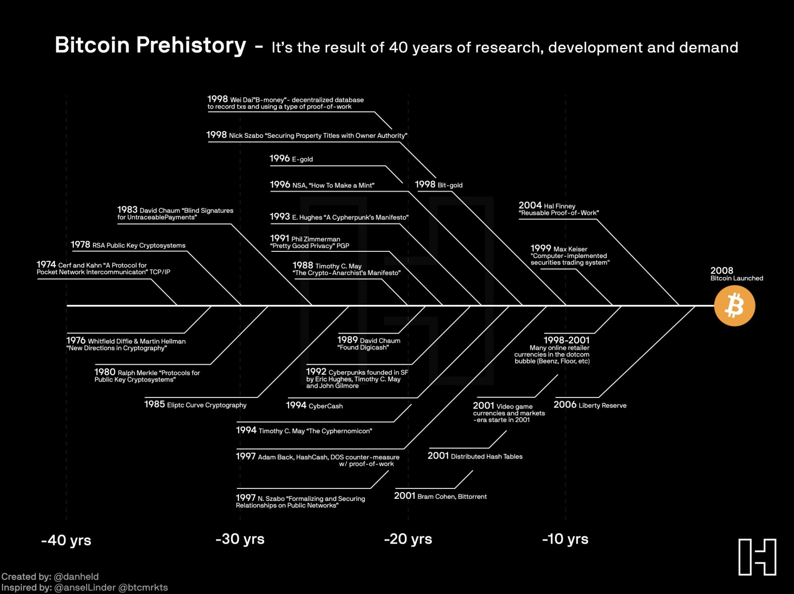

# Blockchain

<!--toc:start-->

- [Blockchain](#blockchain)
  - [About](#about)
  - [Part 1](#part-1)
    - [History of exchange](#history-of-exchange)
      - [Barter](#barter)
      - [Barter and bitcoin](#barter-and-bitcoin)
      - [Money How](#money-how)
      - [Regulated money](#regulated-money)
    - [Web](#web)
    - [Double transaction](#double-transaction)
    - [Intermediaries](#intermediaries)
    - [Satoshi Nakamoto](#satoshi-nakamoto)
  - Part 2
    <!--toc:end-->

## About

Blockchain-focused section of the course

## Part 1

### History of exchange

#### Barter

All products are bound by offer and demand.
Their price fluctuates as much as they're required by the consumer.

The market moves through and from fear and greed. Basically **FOMO**

As the market flowed a simple piece-by-piece barter was changed into a product-standard.
This product was gold.
As a standard all barters were standardized into a gold-based value.

After, it evolved to coin-based value, then paper value and then FIAT.
_FIAT_ are currencies issued by the government,
and are not backed by a physical commodity such as gold.

With this inclusion and control,
exchanges were turned then into plastic money, and then electronic.

> What backs the dollar?
> Nothing so far.

[Wanna check how much the _US_ owes?](https://www.imf.org/en/Countries/USA)
[Check again](https://www.usdebtclock.org)

During the pandemic,
the solution thought after to solve the impending crisis was to _print_ more money.

#### Barter and bitcoin

- Good
  - A barter is the most simple form of exchanging value
  - Only practical in small circles
  - The bigger the market, more difficult to control
  - It isn't affected by market fluctuations and/or de-valuations.
  - No intermediaries
  - Non-taxable
- Bad
  - Lack of scale coincidence
  - Lack of temporary line.
    - What if i don't have the ripe apples yet?
  - Lack of location coincidence
- All three previous solved by bitcoin?
  - Apparently yes

So what's cool about BC?

- Indirectly exchange direct money.

#### Money How

- Functions
  - As a way of exchange
  - As a value deposit
  - As a _countable_ unit
- How
  - Merchandise (physical things such as diamonds, gold bar, salt, _cacao and stones_)
  - Metallic coin
  - Paper money
  - Debt
  - FIAT (backed by law)
  - Electronic

#### Regulated money

| Redeemable                                                              | Non-redeemable                                                        |
| ----------------------------------------------------------------------- | --------------------------------------------------------------------- |
| Backed by metals                                                        | Backed by the government's debt                                       |
| The govt only assumes the responsibility of holding the physical units. | The govt can emit decrees to force the population into using the coin |

### Web

- Web 1.0 & 2.0
  - Basically exchanged information from one node towards another towards another
  - Web, DOCS, PDFs, Email, PPT, Pics
- Web 3.0
  - Exchange of value instead of information
    - Art, currency.
    - Single transaction currency.

### Double transaction

Double transaction is the issue where certain $100 dollars can be duplicated
for multiple transactions by and through the same person. Basically unregulated.

- Bitcoin
  - It solves the issue of double transaction.
  - A single asset can't be sold or bartered twice.
- Traditional solutions
  - Banks as intermediaries
  - Large social media companies
  - Government
  - Large credit card companies

### Intermediaries

Decent at their job but:

| Concept     | Description                                           |
| ----------- | ----------------------------------------------------- |
| Centralized | Hackable and corruptable                              |
| Exclusion   | Exclude millions from the global economy              |
| Slow        | An email takes seconds, an electronic transfer - days |
| Comissions  | High in costs                                         |
| Info        | No privacy or access to the information               |

#### Satoshi Nakamoto

Satoshi Nakamoto created the **Bitcoin: peer-to-peer electronic system** protocol

- Bitcoin white paper:
  - Decentralized
  - No intermediaries
  - Global
  - Digital

## Part 2

### Basics

#### About bitcoin

- Distributed & decentralized.
- Only 21 million of bitcoins will ever be emitted.
- Satoshi Nakamoto (whoever he/she/they is/are) owns a million of those.
- Currently 19.6 million coins are in circulation.
  - Every 4 years, more btc are pushed out into the blockchain
  - The qty of btc pushed out is **halved** by each iteration.
  - By 2140, there will be no more full btc pushed out as the 21 million will be out.
- Not a pyramid scheme but similar (lol)

  - Decentralized so basically no one at the top
  - It's based on maket-driven value instead of recruitment.
  - Blockchain
  - Self-regulated

- History of btc:

#### About blockchain

- Blocks like in minecraft
- Generated every 10 minutes
- Holds transactions info
- Can be trusted
  - **Can be traced**
  - Is liquid
- Has governance

> The history is related into the [Cypherpunk movement](https://nakamoto.com/the-cypherpunks/).

#### About mining

Basically whenever you want bitcoins there's only two options to get them:

- Mining
- Buy from another person that already owns btc

This results in very specific outcomes whenever someone is trading with btc.
No longer profitable due to the amount of btc in each block.
